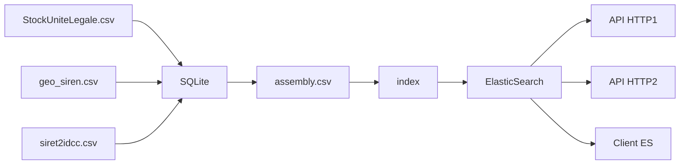

# recherche-entreprises

API de recherche d'entreprise basée sur ElasticSearch et exploitant les données de la [base SIRENE de l'INSEE](https://www.insee.fr/fr/information/3591226), de [plusieurs jeux de données data.gouv.fr](./assembly/scripts/get-data.sh) et de [kali-data](https://github.com/SocialGouv/kali-data) pour les conventions collectives.

Un frontend de démo est disponible ici : https://recherche-entreprises.fabrique.social.gouv.fr

Les données sont mise à jour toutes les semaines

---

⚠️ LA DINUM propose une autre API similaire, officielle et disponible à cette adresse : https://api.gouv.fr/les-api/api-recherche-entreprises

---

## Composants

Le dépôt de code contient plusieurs composants utilisables indépendamment :

| composant | description                                        |
|-----------|----------------------------------------------------|
| index     | Indexation des jeux de données dans Elastic Search |
| api       | API NodeJS pour interroger l'index Elastic         |
| front     | Frontend de démo en ReactJS                        |

L'étape d'indexation peut être automatisée pour maintenir les données à jour en continu (ex: hebdomadaire).

## Fonctionnement 


 
## Données :

| Dataset                                                                                                                                                                        | usage                                                    |
| ------------------------------------------------------------------------------------------------------------------------------------------------------------------------------ | -------------------------------------------------------- |
| [geo-sirene](https://www.data.gouv.fr/fr/datasets/base-sirene-des-entreprises-et-de-leurs-etablissements-siren-siret/#resource-community-c6006b4d-0b4b-4504-a762-1efe69c7ed18) | Version géocodée du stock des établiseement              |
| [insee-sirene](https://www.data.gouv.fr/fr/datasets/base-sirene-des-entreprises-et-de-leurs-etablissements-siren-siret/)                                                       | Base Sirene des entreprises et de leurs établissements   |
| [siret2idcc](https://www.data.gouv.fr/fr/datasets/liste-des-conventions-collectives-par-entreprise-siret/#_)                                                                   | Lien vers la convention collective                       |
| [kali-data](https://github.com/SocialGouv/kali-data)                                                                                                                           | Informations sur les conventions collectives             |
| [codes-naf](https://github.com/SocialGouv/codes-naf)                                                                                                                           | Liste des codes NAF (Nomenclature d’activités française) |

## Développement

### Pré-requis

Pour lancer les différentes parties du projet, un certain nombre d'outil doivent être présent sur la machine:

- node
- yarn
- docker et docker-compose
- wget
- sqlite3

### Assemblage des données

Le script `index/sqlite/build.sh` permet de permet de télécharger les CSV puis aggréger les données pour les re-exporter dans CSV "plat". Le fichier `./data/assembly.csv` généré fait +6Go avec plus de 30 millions de lignes.

Cette opération peut durer ~45 minutes selon votre setup

### Indexation dans Elastic Search

Cette étape permet de mettre à jour les données dans l'index Elasticsearch à partir du fichier `assembly.csv` généré à l'étape précédente.

La mise à jour exploite la fonctionnalité [alias](https://www.elastic.co/guide/en/elasticsearch/reference/7.16/aliases.html) d'Elasticsearch pour éviter les downtimes.

Pour lancer une indexation :

```sh
yarn
ELASTICSEARCH_URL=https://elastic_url:9200 ELASTICSEARCH_API_KEY=key_with_writing_rights ASSEMBLY_FILE=./data/assembly.csv yarn start
```

Le script `scripts/create-es-keys.sh` permet de créer des tokens pour lire/écrire sur ces index. **Cette étape n'est pas nécessaire pour le développement local.**

### Lancement de l'API

Cette étape permet de lancer l'API de démo qui va servir les requêtes jusqu'à Elasticsearch.

```sh
# En partant de la racine du projet
cd api

yarn install
yarn build

ELASTICSEARCH_URL=http://localhost:9200 yarn start
```

Le temps d'indexation est d'environ 1h.

### Wokflows GitHub

Des workflows GitHub permettent de mettre à jour les index et sont lancés manuellement

## Projets relatifs

- Annuaire-entreprises : https://annuaire-entreprises.data.gouv.fr
- API Entreprise : https://entreprise.api.gouv.fr/catalogue/
